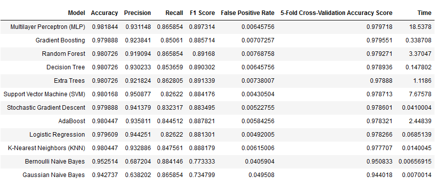

# pulsar-prediction

**Задача**:  
* Требуется построить алгоритмы, способные классифицировать объекты из исходного множества (датасет в формате *.csv). 

**Решение**: 

Первый этап:
* Классификация объектов с помошью алгоритма "Случайный лес" из библиотеки sklearn. Вывод полученной точности, метрик, построение ROC-кривой и матрицы ошибок методами библиотеки sklearn.
* Построение классификатора методом логистической регрессии без использования библиотеки sklearn. Вывод полученный точности и построения графика минимизации затрат.

Второй этап:
* Тюнниг полученных моделей:

MLPClassifier (activation='logistic', alpha=0.0001, batch_size='auto', beta_1=0.9, beta_2=0.999, early_stopping=False, epsilon=1e-08,
 hidden_layer_sizes=10, learning_rate='constant', learning_rate_init=0.001, max_iter=200, momentum=0.9, n_iter_no_change=10, nesterovs_momentum=True, power_t=0.5, random_state=None, shuffle=True, solver='adam', tol=0.0001, validation_fraction=0.1, verbose=False, warm_start=False):
              
                precision    recall  f1-score   support
          0       0.99      0.99      0.99      3252
          1       0.94      0.86      0.90       328

   macro avg      0.96      0.93      0.94      3580
   
weighted avg      0.98      0.98      0.98      3580

Accuracy: 0.982122905027933

RandomForestClassifier(n_estimators=200, min_samples_split=5, min_samples_leaf=4, max_features='auto', max_depth=80, bootstrap=True,oob_score = False):

                precision    recall  f1-score   support
           0       0.98      1.00      0.99      3252
           1       0.95      0.84      0.89       328          

   macro avg       0.96      0.92      0.94      3580

weighted avg       0.98      0.98      0.98      3580

Accuracy: 0.9810055865921787

SVC(C=0.8706861025732241, cache_size=200, class_weight=None, coef0=0.0,decision_function_shape='ovr', degree=3, gamma=0.7972383904732814, kernel='poly', max_iter=-1, probability=False, random_state=None, shrinking=True, tol=0.001, verbose=False):

                precision    recall  f1-score   support
          0       0.98      1.00      0.99      3252
          1       0.95      0.84      0.89       328
   
  macro avg       0.96      0.92      0.94      3580
  
weighted avg      0.98      0.98      0.98      3580

Accuracy: 0.9812849162011174

Третий этап:
* Финализирование полученных результатов:

